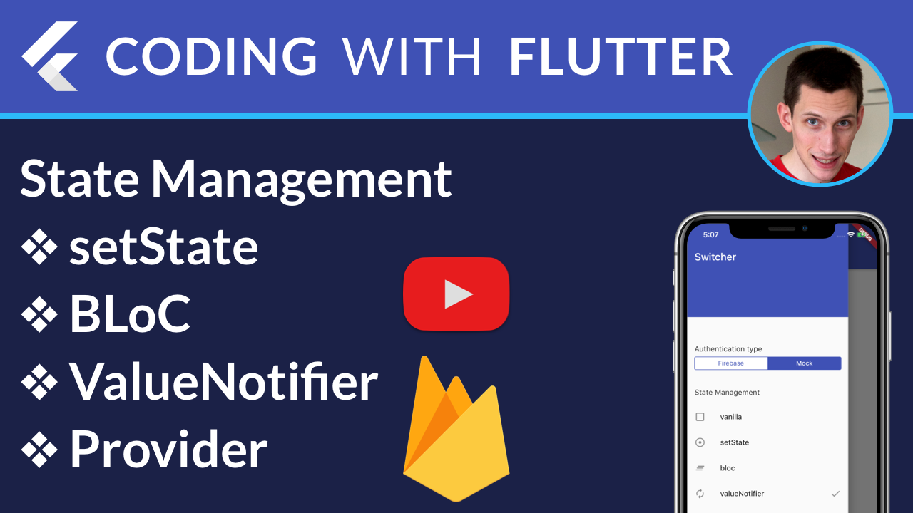
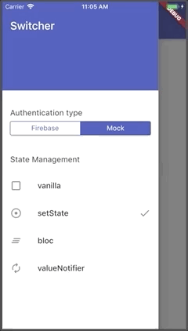

## State Management Comparison: Authentication Flow

This sample app shows different approaches to managing state in Flutter:

### [`setState`](https://flutter.dev/docs/development/data-and-backend/state-mgmt/options#setstate) vs [`BLoC`](https://flutter.dev/docs/development/data-and-backend/state-mgmt/options#bloc--rx) vs [`ValueNotifier`](https://api.flutter.dev/flutter/foundation/ValueNotifier-class.html)/[`ChangeNotifier`](https://api.flutter.dev/flutter/foundation/ChangeNotifier-class.html) with [Provider](https://pub.dev/packages/provider)

**Use case: Setting a loading state while an authentication request is in progress**

### YouTube video walkthrough

Also published as an article [here](https://medium.com/coding-with-flutter/flutter-state-management-setstate-bloc-valuenotifier-provider-2c11022d871b).

### Preview

### Overview

Flutter offers [various state management approaches](https://flutter.dev/docs/development/data-and-backend/state-mgmt/options#bloc--rx).

This project implements a simple use case with different techniques. A [Drawer](https://api.flutter.dev/flutter/material/Drawer-class.html) menu can be used to switch between them.

This serves both as an **introduction** and a **comparison** of different approaches.

### Currently supported

- [x] vanilla (basic implementation without loading state)
- [x] setState
- [x] BLoC with Provider
- [x] ValueNotifier with Provider

<!--
### YouTube video walk-through

-->

## Running the project with Firebase

To use this project with Firebase authentication, some configuration steps are required.

- Create a new project with the Firebase console.
- Add iOS and Android apps in the Firebase project settings.
- On Android, use `com.codingwithflutter.simple_auth_comparison_flutter` as the package name.
- then, download and copy `google-services.json` into `android/app`
- On iOS, use `com.codingwithflutter.simpleAuthComparisonFlutter` as the bundle ID
- then, download and copy `GoogleService-Info.plist` into `iOS/Runner`, and add it to the Runner target in Xcode

## References

- [Flutter Docs: List of state management approaches](https://flutter.dev/docs/development/data-and-backend/state-mgmt/options)

----

All the state management techniques used in this project are explained in great detail, and implemented step-by-step in my Flutter & Firebase Udemy course.

This is available for early access at this link (discount code included):

- [Flutter & Firebase: Build a Complete App for iOS & Android](https://www.udemy.com/flutter-firebase-build-a-complete-app-for-ios-android/?couponCode=DART15&password=codingwithflutter)

## [License: MIT](LICENSE.md)
